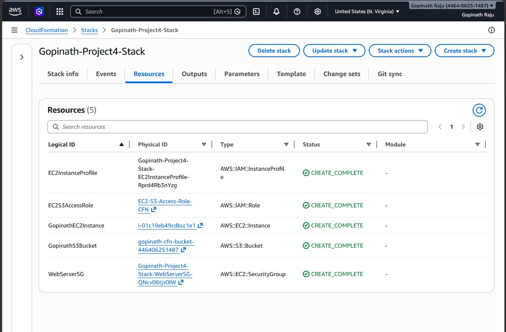
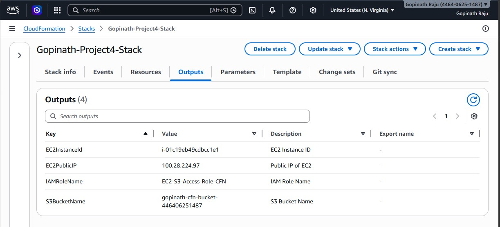
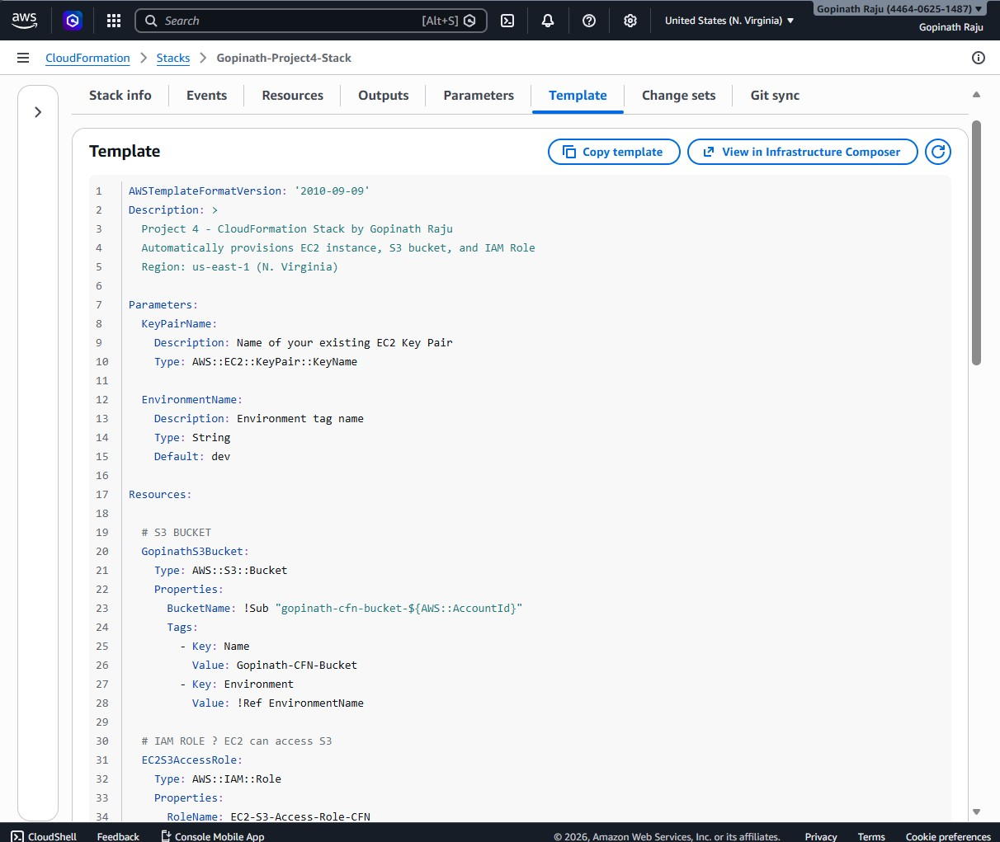

# 🏗️  AWS CloudFormation (Infrastructure as Code)

## 📌 Project Overview

This project demonstrates how to use **AWS CloudFormation** to automatically provision cloud infrastructure using a YAML template — no manual clicking required!

Instead of creating resources one by one in the AWS Console, a single CloudFormation template deploys everything in one shot.

---

## 🎯 What Was Built

| Resource | Name | Type |
|---|---|---|
| EC2 Instance | `Gopinath-CFN-EC2` | `t3.micro` — Amazon Linux 2 |
| S3 Bucket | `gopinath-cfn-bucket-446406251487` | Private bucket |
| IAM Role | `EC2-S3-Access-Role-CFN` | EC2 → S3 Read Access |
| Security Group | `Gopinath-CFN-SG` | SSH port 22 allowed |
| IAM Instance Profile | `EC2InstanceProfile` | Attaches IAM Role to EC2 |

---

## 🛠️ Tools & Services Used

- **AWS CloudFormation** — Infrastructure as Code (IaC)
- **AWS EC2** — Virtual machine (t3.micro)
- **AWS S3** — Object storage bucket
- **AWS IAM** — Role & Instance Profile
- **YAML** — Template language for CloudFormation

---

## 📋 CloudFormation Stack Details

- **Stack Name:** `Gopinath-Project4-Stack`
- **Region:** `us-east-1` (N. Virginia)
- **Status:** ✅ `CREATE_COMPLETE`
- **Template:** `cloudformation-template-v2.yaml`

---

## 📤 Stack Outputs

| Output Key | Value |
|---|---|
| EC2InstanceId | `i-01c19eb49cdbcc1e1` |
| EC2PublicIP | `100.28.224.97` |
| IAMRoleName | `EC2-S3-Access-Role-CFN` |
| S3BucketName | `gopinath-cfn-bucket-446406251487` |

---

## 📸 Screenshots

### 1. Stack Created — CREATE_COMPLETE

### 2. Resources — All 5 Created Successfully

### 3. Outputs — EC2 IP, S3 Bucket, IAM Role

### 4. Template — YAML Code in AWS

---

## 💡 Key Concepts Learned

- **Infrastructure as Code (IaC)** — Managing cloud resources using code files instead of manual clicks
- **CloudFormation Stack** — A group of AWS resources created and managed as a single unit
- **Parameters** — Dynamic inputs (like Key Pair name) that make templates reusable
- **Outputs** — Values displayed after stack creation (EC2 IP, bucket name, etc.)
- **IAM Instance Profile** — Allows EC2 instances to assume an IAM Role

---

## 💼 Resume Bullet Point

> *Authored CloudFormation templates to automate provisioning of EC2 instances, S3 buckets, and IAM roles using Infrastructure as Code (IaC) methodology, reducing manual deployment effort.*

---

## 👨‍💻 Author

**Gopinath Raju**
AWS SA - FITA ACADEMY(2026)
